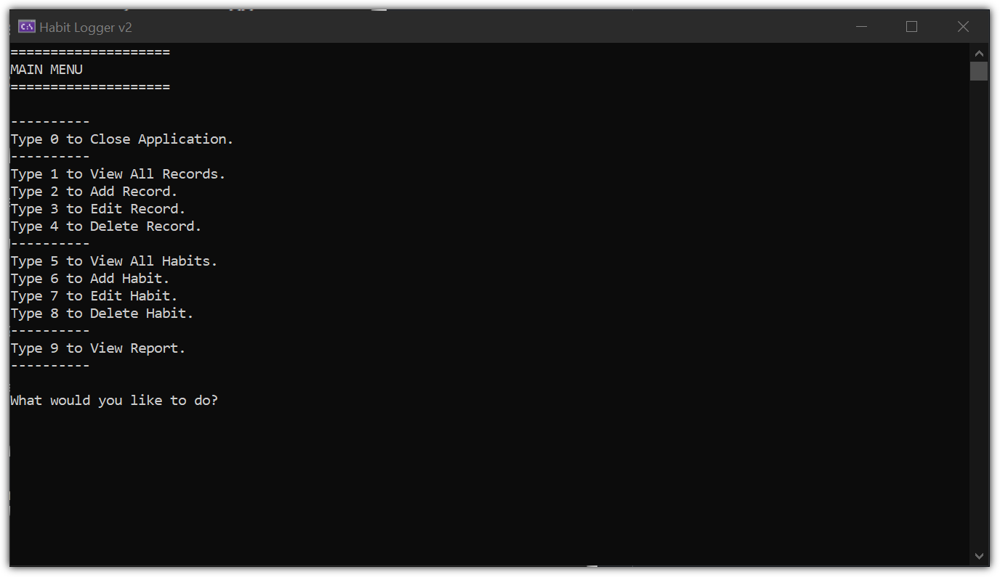

# Habit Logger v2

This is a redo of my first CRUD application. It's the first project I've created that interacts with a database. I built it using C# and SQLite. This project is part of the curriculum from [The C# Academy](https://www.thecsharpacademy.com/).

## Requirements

- [x] This is an application where you’ll register one habit.
- [x] This habit can only be tracked by quantity (ex. number of water glasses a day)
- [x] Users need to be able to input the date of the occurrence of the habit
- [x] The application should store and retrieve data from a real database
- [x] When the application starts, it should create a sqlite database, if one isn’t present.
- [x] It should also create a table in the database, where the habit will be logged.
- [x] The users should be able to insert, delete, update and view their logged habit.
- [x] You should handle all possible errors so that the application never crashes.
- [x] You can only interact with the database using ADO.NET. You can’t use mappers such as Entity Framework or Dapper.
- [x] Follow the DRY Principle, and avoid code repetition.
- [x] Your project needs to contain a Read Me file where you'll explain how your app works.

## Challenge Features

- [x] If you haven't, try using parameterized queries to make your application more secure.
- [x] Let the users create their own habits to track. That will require that you let them choose the unit of measurement of each habit.
- [x] Seed data into the database automatically when the database gets created for the first time, generating a few habits and inserting records.
- [x] Create a report functionality where the users can view specific information

